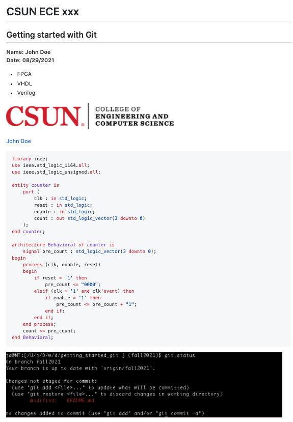

# Getting started with Git
**California State University, Northridge**  
**Department of Electrical and Computer Engineering**  

## Objective

Help students become familiar with basic Git commands and Git workflow.

## Requirements

- Git >= 2.33
- GitHub account
- Link to GitHub classroom assignment

## References
- https://git-scm.com/
- https://guides.github.com/

## Introduction

## What is Git
Git is a free and open source distributed version control system.
Source: https://git-scm.com/

## What is GitHub
GitHub is a code hosting platform for version control and collaboration.
GitHub is built on Git version control system. It provides a web-based 
user interface and cloud storage for open source projects. It also provides
Enterprise version for private code hosting.

Source: https://guides.github.com/activities/hello-world/

## What is Markdown language:
Markdown is a lightweight and easy-to-use syntax for styling all forms 
of writing on the GitHub platform using a plain-text.

Source: https://guides.github.com/features/mastering-markdown/

## Tasks

:point_right: **Task 1**: Clone git repo to your local

Use the following command to clone the assignment repo to your local machine:

```bash
$ git clone name-of-the-repo
```

Note: Make sure to replace `name-of-the-repo` with your assignment git link.  
Note: The `$` sign is not part of the command. It is a convensional way to say 
this command should be run in the command prompt of a terminal.

Updae the README.md file with the following markdown tags:

:point_right: **Task 2**: Make the following text a heading 1 on the first line of README.md file in the main folder:
```
CSUN ECE your-class-number
```

:point_right: **Task 3**: Make the following text a heading 2 on the second line of README.md file in the main folder:
```
Getting started with Git
```

:point_right: **Task 4**: Make the following text bold on the lines 3 to 4 README.md file in the main folder:
```
Name: your-name
Date: submission-date
```

In the above make sure to preview your README file to make sure each 
`Name` and `Date` are on separate lines.

*Note: Do not use `<br/>` to create line break.*  
*Hint: Use 2 spaces at the end of line to create break.*  

:point_right: **Task 5**: Create and ordered list on line 6 to 8

```
FPGA
VHDL
Verilog
```

:point_right: **Task 5**: Add CSUN logo image on line 10. The image is located in
`./img/csun_eng_logo.png`. Use `CSUN ENG` as alternative name of the image.

:point_right: **Task 6**: Add your GitHub profile link to line 12 with your name as the link title
Make sure the link is on separate line and not on the same line as image.

*Hint: Having an extra line will let Markdown compiler to use a line break.*

:point_right: **Task 7**: Add the following VHDL code on line 14. Make sure to
use `vhdl` keyword at the code block to highlight VHDL syntax.

```
library ieee;
use ieee.std_logic_1164.all;
use ieee.std_logic_unsigned.all;

entity counter is
    port (
        clk : in std_logic;
        reset : in std_logic;
        enable : in std_logic;
        count : out std_logic_vector(3 downto 0)
    );
end counter;

architecture Behavioral of counter is
    signal pre_count : std_logic_vector(3 downto 0);
begin
    process (clk, enable, reset)
    begin
        if reset = '1' then
            pre_count <= "0000";
        elsif (clk = '1' and clk'event) then
            if enable = '1' then
                pre_count <= pre_count + "1";
            end if;
        end if;
    end process;
    count <= pre_count;
end Behavioral;
```

:point_right: **Task 9**: Use the following command to see all unstaged files

```
$ git status
```
See here for syntax info: https://git-scm.com/docs/git-status

:point_right: **Task 10**: Take a screenshot from your git status output terminal
and save the file as `git_stat.png` in the `./img` folder. 
On line 45 of README add the screenshot image to show up in your file. 
Use `git status before stage` as alternate name of your image.

:point_right: **Task 11**: Press enter to add a new line which would be line 46 
in your README file. Files should have an empty line at the end. No whitespace 
or other character should be on the last line.

:point_right: **Task 12**: Use the following command to stage all files

```
$ git add .
```

See here for syntax info: https://git-scm.com/docs/git-add


:point_right: **Task 13**: Use the following command to commit your changes

```
$ git commit -m 'your-git-user-name: a shor message describing your change'
```

See here for syntax info: https://git-scm.com/docs/git-commit

:point_right: **Task 14**: Use the following command to push your changes to remote repo

```
$ git push origin master
```

Note: Verify your changes look correct in the GitHub page.
If changes are not correct make the necessary changes and repeat tasks 
12, 13, and 14 to push your update to the repo.

Hint: Your output should look like the following:  




:point_right: Task 15: Creating a new branch and checking out a branch

    Create a new directory named branch_test:

```bash
mkdir branch_test
cd branch_test
```

Create a new file named testfile.txt:

```bash
touch testfile.txt
```

Add some content to testfile.txt:

```bash
echo "This is a test file." > testfile.txt
```

Stage and commit the file:

```bash
git add testfile.txt
git commit -m "Initial commit with testfile.txt"
```

Create a new branch named feature-branch:

```bash
git branch feature-branch
```

Switch to the new branch:

```bash
git checkout feature-branch
```

You can also combine the branch creation and checkout into a single command:

```bash
git checkout -b feature-branch
```

Verify that you are on the feature-branch:

```bash
git branch
```

The current branch will be highlighted with an asterisk (*).

:point_right: Task 16: Stashing and popping stash in Git

While still in the branch_test directory, add another line to testfile.txt:

```bash
echo "This line is for stash testing." >> testfile.txt
```

Check the status to see the unstaged changes:

```bash
git status -u
```

Stash the changes temporarily:

```bash
git stash
```

This command will store your changes and revert the working directory to the last commit.

Verify that the changes have been stashed:

```bash
git status -u
```
The working directory should be clean.

Pop the stash to reapply the changes:

```bash
git stash pop
```

This command will apply the stashed changes back to your working directory.

Verify that the changes have been reapplied:

```bash
git status -u
```

You should see the changes as unstaged again.

:point_right: Task 17: Committing your changes

Stage the modified testfile.txt:

```bash
git add testfile.txt
```
Commit the changes with a meaningful commit message:

```bash
git commit -m "Added a line for stash testing"
```

Verify that the commit was successful:

```bash
git log --oneline
```

You should see your latest commit at the top of the log.

:point_right: Task 18: Ignoring files in Git

Create a new directory named ignore_test and navigate into it:

```bash
mkdir ignore_test
cd ignore_test
```
Initialize a new Git repository:

Create some test files:

```bash
touch file1.txt file2.log secret.txt
```

Create a .gitignore file:

```bash
touch .gitignore
```

Open .gitignore in a text editor and add the following lines:

```
*.log
secret.txt
!important.log
```
The first line ignores all .log files.
The second line ignores the secret.txt file.
The third line negates the .log rule for a file named important.log.

Save and close the .gitignore file.

Verify the ignored files:

```bash
git status
```

You should see that file2.log and secret.txt are ignored, but important.log is not.

Create the important.log file and check the status again:

```bash
touch important.log
git status
```
You should see important.log as an unstaged file, despite the .gitignore rule.

:point_right: Task 19: Git log & history

Use the following command to see the Git log in a simple format:

```bash
git log
```
For a more concise view, showing just the commit messages:

```bash
git log --oneline
```
To see a graphical representation of the commit history, run:

```bash
git log --graph --oneline --all --decorate
```
This command provides a visual representation of branches and merges.

Explore additional options for the Git log by running:

```bash
git log --help
```
:point_right: Task 20: Merging

In your branch_test directory, make sure you are on the feature-branch:

```bash
git checkout feature-branch
```
Make some changes to testfile.txt:

```bash
echo "This is a change on the feature branch." >> testfile.txt
```

Stage and commit the changes:

```bash
git add testfile.txt
git commit -m "Feature branch changes"
```

Switch back to the master branch:

```bash
git checkout master
```

Merge the changes from feature-branch into master:

```bash
git merge feature-branch
```

Verify the merge:

```bash
git log --graph --oneline --all --decorate
```

You should see the merge in the history.

:point_right: Task 21: Syncing with a remote

Fetch the latest changes from the remote repository:

```bash
git fetch origin
```
Pull the latest changes from the remote to your local branch:

```bash
git pull origin master
```

Verify that your local branch is up-to-date with the remote:

```bash
git status
```
You should see a message indicating that your branch is up-to-date.

:point_right: Task 22: Resolving merge conflicts

Create a conflict by modifying testfile.txt in both the master and feature-branch branches.

On the master branch, make a change:

```bash
echo "Change on master branch." >> testfile.txt
git commit -am "Change on master"
```

Switch to the feature-branch and make a different change:

```bash
git checkout feature-branch
echo "Different change on feature branch." >> testfile.txt
git commit -am "Change on feature branch"
```

Switch back to the master branch and try to merge feature-branch:

```bash
git checkout master
git merge feature-branch
```

Git will report a conflict.

Open testfile.txt to resolve the conflict. The conflicting areas will be marked with <<<<<<, ======, and >>>>>>. Edit the file to resolve the conflict.

After resolving the conflict, stage the changes:

```bash
git add testfile.txt
```

Commit the resolution:

```bash
git commit -m "Resolved merge conflict"
```
:point_right: Task 23: Creating a pull request

Push your feature-branch to the remote repository:

```bash
git push origin feature-branch
```
Navigate to the repository on GitHub.

You will see an option to create a pull request for feature-branch. Click on it.

Review the changes in the pull request and add a description.

Submit the pull request for review.

After the pull request is reviewed and approved, merge it into the master branch on GitHub.

Pull the changes to your local repository to sync:

```bash
git pull origin master
```
